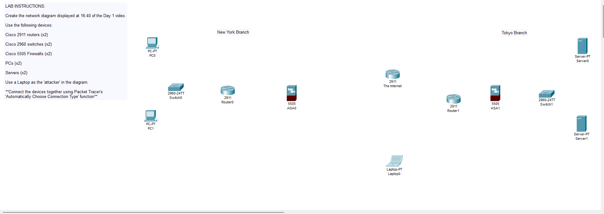

# Day 1 Lab – Network Devices Topology

**Lab Source:** Jeremy’s IT Lab – Day 1 (Network Devices)  
**Timestamp Reference:** Network diagram shown at 16:40 in the Day 1 video  
**Lab Type:** Packet Tracer topology building

---

## Lab Instructions

Create the network diagram displayed at 16:40 of the Day 1 video.

**Required Devices:**
- Cisco 2911 routers × 2
- Cisco 2960 switches × 2
- Cisco 5505 Firewalls (ASA) × 2
- PCs × 2
- Servers × 2
- Laptop × 1 (used as the “attacker”)

**Connection Method:**  
Use Packet Tracer’s **“Automatically Choose Connection Type”** function when connecting devices.

---

## Topology Overview

The topology represents two branch offices connected through the Internet:

- **New York Branch** (left side)
- **Tokyo Branch** (right side)
- Central **Internet** cloud/router
- An external **attacker** (Laptop) connected to the Internet

### Logical Layout

**New York Branch:**
- PC0 and PC1 connected to Switch0 (2960-24TT)
- Switch0 → Router0 (2911)
- Router0 → ASA0 (5505 Firewall)
- ASA0 → Internet

**Tokyo Branch:**
- Server0 and Server1 connected to Switch1 (2960-24TT)
- Switch1 → ASA1 (5505 Firewall)
- ASA1 → Router1 (2911)
- Router1 → Internet

**External:**
- Laptop0 (attacker) connected directly to the Internet cloud

---

## Key Observations & Notes

### Ports Needed to Be Enabled
In this lab it was necessary to **manually turn on multiple ports** (`no shutdown`) in order for all connections to become active and show green triangles in Packet Tracer.

This is a common early lesson:
- Many interfaces on routers, switches, and especially ASA firewalls start in the administratively down state.
- Always verify interface status with `show ip interface brief` or by checking the link lights in Packet Tracer.

### Device Roles Demonstrated

| Device Type       | Role in Topology                  | Key Takeaway                                      |
|-------------------|-----------------------------------|---------------------------------------------------|
| PC / Server       | End devices                       | Clients and servers                               |
| 2960 Switch       | Layer 2 LAN connectivity          | Connects end devices within a branch              |
| 2911 Router       | Layer 3 routing                   | Routes traffic between networks                   |
| 5505 ASA Firewall | Security boundary                 | Placed at the edge of each branch                 |
| Laptop            | Attacker / external host          | Represents a threat actor on the Internet         |
| Internet cloud    | Public network                    | Connects the two branches and the attacker        |

---

## Screenshots

1. Complete topology with all links green  
2. Topology showing mixed link status (red/orange)  
3. Devices placed but not yet fully connected  
4. Router0 Config tab – GigabitEthernet0/0 example

---

## Verification Checklist

- [x] All required devices added to the workspace
- [x] Devices arranged to match the video diagram (New York left, Tokyo right)
- [x] All links created using “Automatically Choose Connection Type”
- [x] Necessary interfaces powered on (`no shutdown`)
- [x] Link lights are green where expected
- [x] Labels added for “New York Branch”, “Tokyo Branch”, and “The Internet”

---

## Personal Notes

- This lab is primarily about **familiarity with Packet Tracer** and recognizing different network device icons.
- The presence of firewalls (ASA 5505) and an external attacker early in the course already introduces the idea of network security boundaries.
- Turning ports on manually is a good habit to build right from Day 1.

---

**Status:** Completed

---

## Image Links

---

