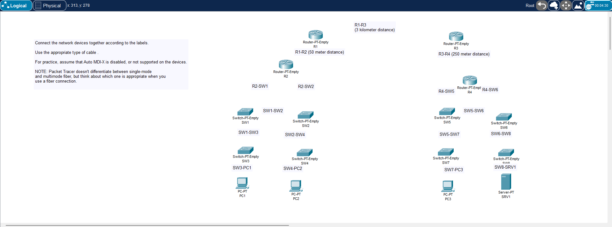
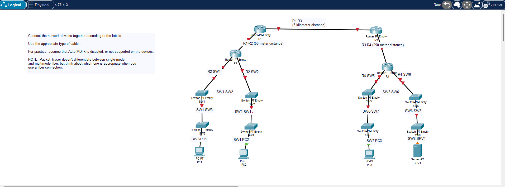
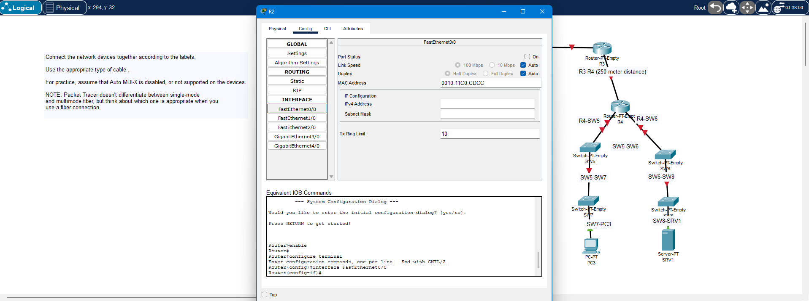
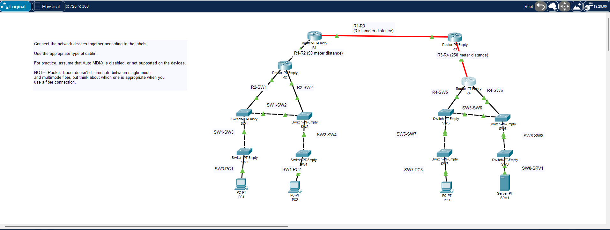

# Day 2 Lab – Interfaces and Cables

**Lab Source:** Jeremy’s IT Lab – Day 2 (Interfaces and Cables)  
**Lab Type:** Packet Tracer – Connecting devices with correct cable types

---

## Lab Instructions

Connect the network devices together according to the labels.

Use the appropriate type of cable.

For practice, assume that **Auto MDI-X is disabled**, or not supported on the devices.

**NOTE:** Packet Tracer doesn't differentiate between single-mode and multimode fiber, but think about which one is appropriate when you use a fiber connection.

---

## Key Concepts Covered

- Choosing the correct cable type based on device types
- Copper cables: Straight-through vs Crossover
- Fiber connections (and thinking about single-mode vs multimode)
- Auto MDI-X (practicing as if it is disabled)
- Enabling interfaces (`no shutdown`)

---

## Cable Selection Rules (Auto MDI-X disabled)

| Connection Type                  | Correct Cable      | Notes                              |
|----------------------------------|--------------------|------------------------------------|
| PC / Server → Switch             | Straight-through   | Most common connection             |
| Router → Switch                  | Straight-through   |                                    |
| Switch → Switch                  | Crossover          | Required when Auto MDI-X is off    |
| Router → Router                  | Crossover          | Required when Auto MDI-X is off    |
| PC → PC / Router → PC            | Crossover          |                                    |
| Long distance (e.g. 3 km)        | Fiber              | Think single-mode for longer runs  |

---

## Key Observations & Notes

### Ports Needed to Be Enabled
Multiple router ports had to be manually turned on (`no shutdown`) before the links would come up.

### Cable Mistakes
Initially connected **all devices with straight-through copper**.  
This was incorrect for:

- Switch-to-Switch connections → needs **crossover**
- Router-to-Router connections → needs **crossover**

This is the main lesson of the lab when Auto MDI-X is assumed to be disabled.

---

## Screenshots

1. Devices placed (not yet connected)
2. Partial connections in progress
3. Topology with mixed link status
4. R2 Config tab + partial topology view

---

## Verification Checklist

- [x] All devices connected according to the labels
- [x] Correct cable type used (straight-through vs crossover)
- [x] Assumed Auto MDI-X is disabled
- [x] Router interfaces enabled (`no shutdown`)
- [x] Considered fiber for longer distance links

---

## Personal Notes

- Had to turn on multiple router ports.
- First attempt used straight-through for everything → incorrect for switch-to-switch and router-to-router links.
- Good practical reminder of why Auto MDI-X exists in modern devices.

---

**Status:** Completed

---

## Image Links

---
