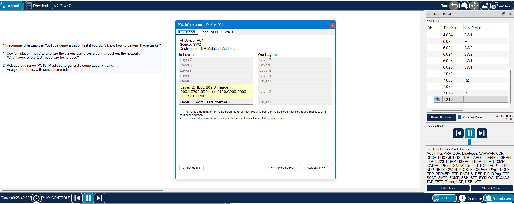
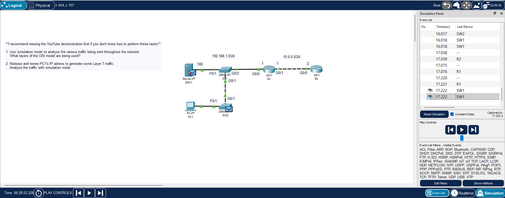
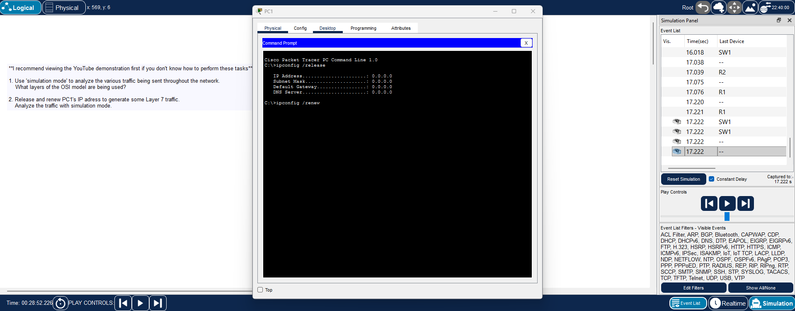
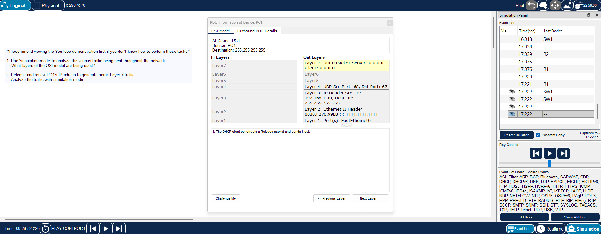

**File path:** `days/day-03-osi-tcpip-model/lab.md`

# Day 3 Lab – OSI Model / TCP/IP Model

**Lab Source:** Jeremy’s IT Lab – Day 3 Lab (OSI Model)  
**Video:** Free CCNA | OSI Model | Day 3 Lab | CCNA 200-301 Complete Course  
**Lab Type:** Packet Tracer – Simulation Mode traffic analysis

---

## Lab Instructions

**I recommend viewing the YouTube demonstration first if you don't know how to perform these tasks.**

1. Use **Simulation Mode** to analyze the various traffic being sent throughout the network.  
   **Question:** What layers of the OSI model are being used?

2. Release and renew PC1’s IP address to generate some Layer 7 traffic.  
   Analyze the traffic with Simulation Mode.

---

## What does `ipconfig /release` and `ipconfig /renew` do?

| Command              | What it does                                                                 | Resulting Traffic                  |
|----------------------|------------------------------------------------------------------------------|------------------------------------|
| `ipconfig /release`  | Tells the PC to give up its current IP address and notify the DHCP server   | DHCP **Release** packet            |
| `ipconfig /renew`    | Asks the DHCP server for a new IP address                                   | DHCP **Discover → Offer → Request → ACK** |

This process generates clear **Layer 7 (Application)** traffic that we can examine in Simulation Mode.

---

## Key Observations

### Traffic analyzed and OSI layers used

| Traffic Type | OSI Layers Used               | Notes                                      |
|--------------|-------------------------------|--------------------------------------------|
| STP          | Layer 2 + Layer 1             | Spanning Tree BPDU – no Layer 3 or higher  |
| OSPF / other | Layer 3 + 2 + 1               | Routing protocol traffic                   |
| DHCP         | Layer 7 + 4 + 3 + 2 + 1       | Generated by release/renew on PC1          |

**Main takeaway:**  
Different protocols use different numbers of OSI layers depending on their purpose. STP stays at Layer 2, while DHCP (an Application layer protocol) uses the full stack.

---

## Screenshots

1. STP packet PDU details (Layer 2 only)
2. Network topology in Simulation Mode
3. PC1 Command Prompt – `ipconfig /release` and `/renew`
4. DHCP packet PDU details (Layer 7 traffic)

---

## Verification Checklist

- [x] Switched to Simulation Mode
- [x] Examined existing traffic (STP, etc.)
- [x] Identified OSI layers for observed traffic
- [x] Released and renewed PC1’s IP address
- [x] Captured and analyzed DHCP (Layer 7) traffic

---

## Personal Notes

- STP only uses Layer 2 and Layer 1.
- DHCP traffic clearly shows Layer 7 all the way down to Layer 1.
- Using Simulation Mode makes the OSI model much easier to understand in practice.

---

**Status:** Completed

---

## Image Links

---

## Screenshot Renaming Table

| New Filename                  | Original Filename |
|-------------------------------|-------------------|
| `01-stp-pdu-details.png`      | `jitl0301.png`    |
| `02-topology-simulation.png`  | `jitl0302.png`    |
| `03-pc1-release-renew.png`    | `jitl0303.png`    |
| `04-dhcp-pdu-details.png`     | `jitl0304.png`    |
