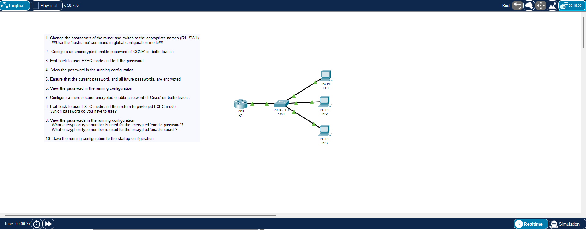
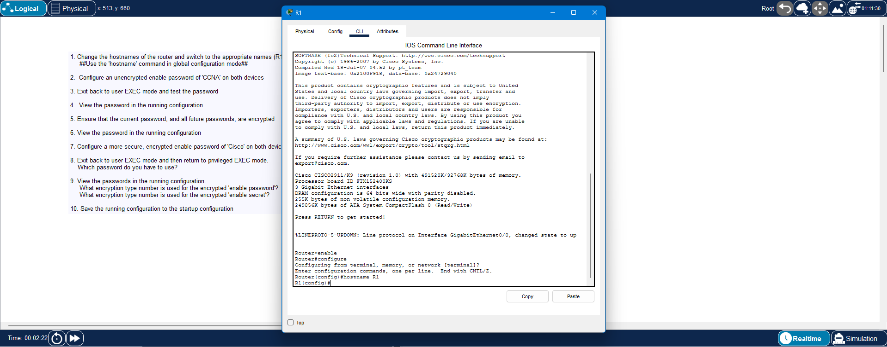
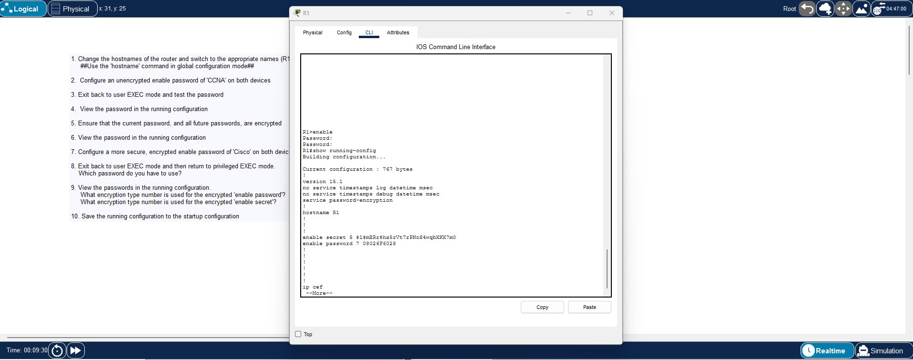

**File path:** `days/day-04-basic-device-security/lab.md`

# Day 4 Lab – Basic Device Security

**Lab Source:** Jeremy’s IT Lab – Day 4 Lab  
**Lab Type:** Packet Tracer – Hostname, enable password, and enable secret configuration

---

## Lab Instructions

1. Change the hostnames of the router and switch to the appropriate names (**R1**, **SW1**)  
   → Use the `hostname` command in global configuration mode

2. Configure an **unencrypted** enable password of `CCNA` on both devices

3. Exit back to user EXEC mode and test the password

4. View the password in the running configuration

5. Ensure that the current password, and all future passwords, are encrypted

6. View the password in the running configuration

7. Configure a more secure, **encrypted** enable password of `Cisco` on both devices

8. Exit back to user EXEC mode and then return to privileged EXEC mode.  
   **Which password do you have to use?**

9. View the passwords in the running configuration.  
   - What encryption type number is used for the encrypted `enable password`?  
   - What encryption type number is used for the encrypted `enable secret`?

10. Save the running configuration to the startup configuration

---

## Answers from the Lab

**Step 8 – Which password do you have to use?**  
→ You must use the **enable secret** password (`Cisco`).  
Once an `enable secret` is configured, it takes priority over the `enable password`.

**Step 9 – Encryption type numbers**  
- `enable password` (after `service password-encryption`) → **Type 7**  
- `enable secret` → **Type 5** (MD5)

---

## Key Commands Used

| Task                              | Command                              |
|-----------------------------------|--------------------------------------|
| Enter global config               | `configure terminal`                 |
| Set hostname                      | `hostname R1` / `hostname SW1`       |
| Unencrypted enable password       | `enable password CCNA`               |
| Encrypt current + future passwords| `service password-encryption`        |
| Encrypted enable secret           | `enable secret Cisco`                |
| View running config               | `show running-config`                |
| Save config                       | `copy running-config startup-config` |

---

## Key Observations

- `enable password` is stored in clear text until `service password-encryption` is applied.
- After `service password-encryption`, it becomes Type **7** (weak, reversible encryption).
- `enable secret` uses Type **5** (MD5 hash) and is much more secure.
- When both exist, the device **only** accepts the `enable secret`.

---

## Screenshots

1. Lab topology (R1 + SW1 + PCs)
2. Hostname configuration on R1
3. `show running-config` showing Type 5 secret and Type 7 password

---

## Verification Checklist

- [x] Hostnames set to R1 and SW1
- [x] Unencrypted enable password configured and tested
- [x] `service password-encryption` applied
- [x] Enable secret configured
- [x] Confirmed that the enable secret is required to enter privileged EXEC
- [x] Identified encryption type numbers (7 and 5)
- [x] Configuration saved to startup-config

---

## Personal Notes

- Type 7 is weak and can be easily reversed.
- Always prefer `enable secret` over `enable password`.
- `service password-encryption` is better than nothing, but Type 5 is the proper way to protect privileged EXEC access.

---

**Status:** Completed

---

## Image Links

---

