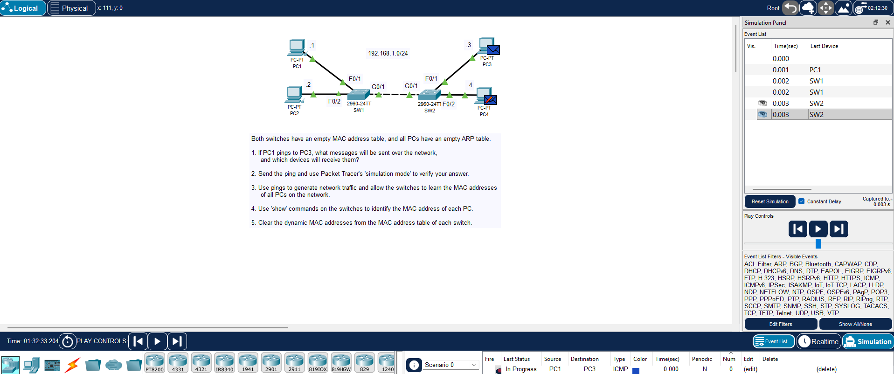
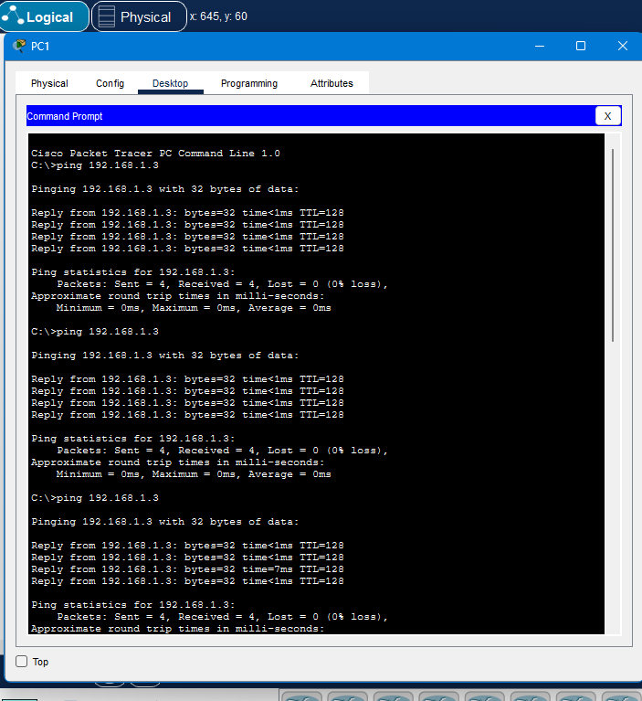
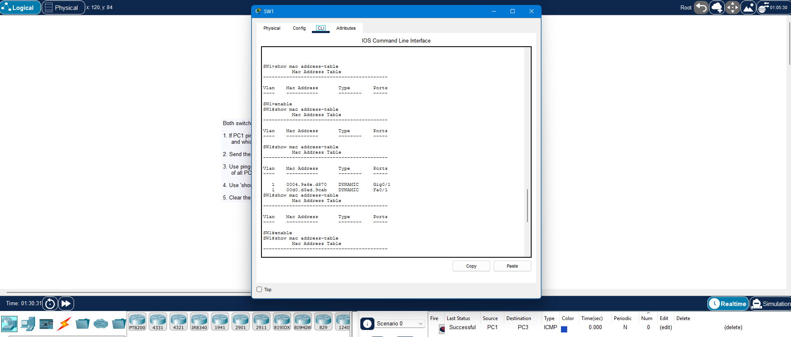
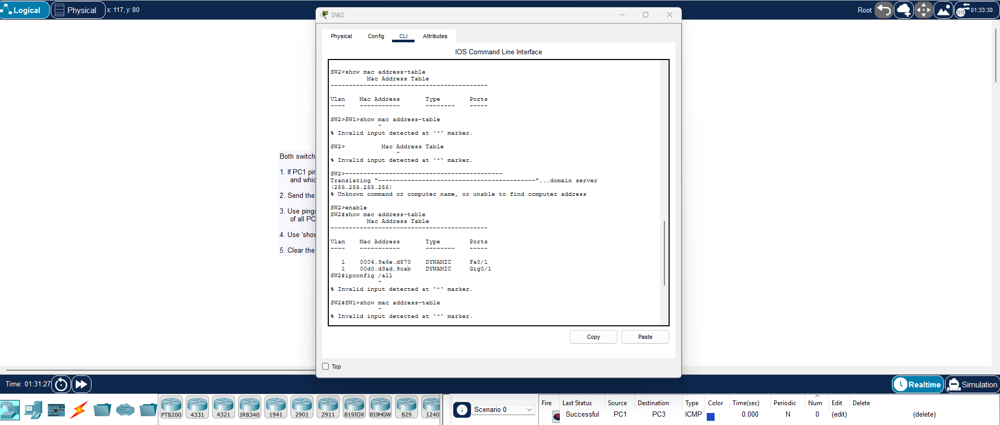

**File path:** `days/day-06-analyzing-ethernet-switching/lab.md`

# Day 6 Lab – Analyzing Ethernet Switching

**Lab Source:** Jeremy’s IT Lab – Day 6 Lab  
**Lab Type:** Packet Tracer – MAC address learning, ARP, and switch behavior

---

## Lab Instructions

Both switches have an empty MAC address table, and all PCs have an empty ARP table.

1. If PC1 pings PC3, what messages will be sent over the network, and which devices will receive them?

2. Send the ping and use Packet Tracer’s Simulation Mode to verify your answer.

3. Use pings to generate network traffic and allow the switches to learn the MAC addresses of all PCs on the network.

4. Use `show` commands on the switches to identify the MAC address of each PC.

5. Clear the dynamic MAC addresses from the MAC address table of each switch.

---

## Answers

**Question 1 – Messages sent when PC1 pings PC3:**
- PC1 sends an **ARP Request** (broadcast) looking for PC3’s MAC address
- Both switches flood the ARP Request out all ports except the incoming port
- PC3 replies with an **ARP Reply** (unicast)
- PC1 then sends the **ICMP Echo Request**
- PC3 replies with **ICMP Echo Reply**

**MAC Addresses identified:**

| PC  | MAC Address       |
|-----|-------------------|
| PC1 | `00D0.D3AD.9CAB`  |
| PC2 | `0060.5C56.14D3`  |
| PC3 | `0004.9A6E.D870`  |

---

## Key Observations

- Switches start with empty MAC address tables and flood unknown unicast frames.
- Switches learn MAC addresses from the **source MAC** of received frames.
- `show mac address-table` displays the learned addresses.
- `clear mac address-table dynamic` clears the learned entries.

---

## Screenshots

1. Topology + Simulation Mode
2. Successful pings from PC1 to PC3
3. `show mac address-table` on SW1
4. `show mac address-table` on SW2

---

## Verification Checklist

- [x] Predicted the messages before pinging
- [x] Verified with Simulation Mode
- [x] Generated traffic so switches learned MAC addresses
- [x] Used `show mac address-table` to identify PC MACs
- [x] Cleared the dynamic MAC address tables

---

## Personal Notes

- ARP Request is broadcast → flooded by switches
- Once MAC addresses are learned, traffic becomes unicast
- Clearing the MAC table forces the learning process to start again

---

**Status:** Completed

---

## Image Links

---

